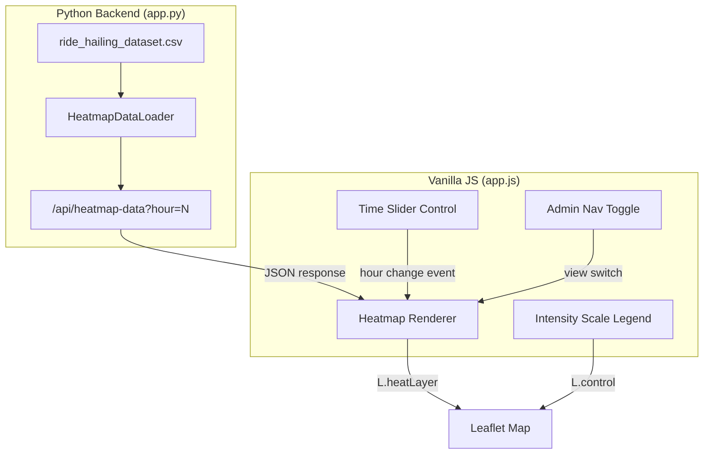

# Design Document: Booking Heatmap

## Overview

The Booking Heatmap feature adds a 24-hour geographic heatmap visualization to the SaktoGo admin dashboard. It loads the synthetic ride-hailing dataset (`ride_hailing_dataset.csv`), aggregates pickup coordinates into a spatial grid by hour-of-day, and renders the density as a color-gradient heat layer on the existing Leaflet map. An interactive time slider lets admins scrub through hours 0–23, with peak-hour indicators highlighting morning (6–9 AM) and evening (5–8 PM) demand spikes.

The feature integrates into the existing admin mode as a view toggle — sharing the same map instance, preserving center/zoom, and hiding ride-request controls when active.

## Architecture



**Design Decisions:**

1. **Server-side aggregation**: The CSV is parsed and aggregated on the backend at startup. The frontend requests pre-computed data per hour, keeping the API response small (~50-200 data points per hour vs 10,000 raw records). This ensures the 500ms update target is achievable.

2. **Leaflet.heat plugin**: Uses the well-established `Leaflet.heat` library (simpleheat-based) for rendering. It's lightweight, works with the existing Leaflet 1.9.4 setup, and supports intensity weighting natively.

3. **Single map instance**: The heatmap renders on the same `L.map` instance used by the route-finder. View switching toggles layer visibility rather than creating/destroying map instances, preserving state.

4. **Grid-based aggregation**: A 0.002-degree grid (~220m cells) provides sufficient spatial resolution for the Olongapo area while keeping the data compact. Each cell's center coordinate and count are returned.

## Components and Interfaces

### Backend: HeatmapDataLoader (app.py)

A module-level class instantiated at server startup that loads and pre-aggregates the CSV dataset.

```python
class HeatmapDataLoader:
    """Loads ride_hailing_dataset.csv and pre-aggregates pickup density by grid cell and hour."""

    GRID_SIZE_DEGREES = 0.002
    REQUIRED_COLUMNS = {"pickup_latitude", "pickup_longitude", "pickup_time"}

    def __init__(self, csv_path: Path):
        self.csv_path = csv_path
        self.hourly_data: dict[int, list[dict]] = {}  # hour -> [{lat, lng, count}]
        self.load_error: str | None = None
        self._load_and_aggregate()

    def _load_and_aggregate(self) -> None:
        """Parse CSV, validate columns, skip malformed rows, aggregate into grid cells per hour."""
        ...

    def get_heatmap_data(self, hour: int) -> dict:
        """Return aggregated data for a specific hour (0-23)."""
        ...

    def _snap_to_grid(self, lat: float, lng: float) -> tuple[float, float]:
        """Snap a coordinate to the center of its grid cell."""
        ...
```

### Backend: API Endpoint

**GET `/api/heatmap-data?hour={0-23}`**

Response (success):
```json
{
  "hour": 7,
  "points": [
    {"lat": 14.8370, "lng": 120.2830, "count": 42},
    {"lat": 14.8390, "lng": 120.2850, "count": 18}
  ],
  "totalBookings": 156
}
```

Response (invalid hour):
```json
{"error": "Invalid hour parameter. Must be an integer between 0 and 23."}
```

Response (file missing):
```json
{"error": "Dataset file not found: ride_hailing_dataset.csv"}
```

Response (missing columns):
```json
{"error": "Dataset missing required columns: pickup_latitude, pickup_time"}
```

### Frontend: Heatmap Renderer

Manages the `L.heatLayer` instance on the shared map.

```javascript
// Heatmap state additions to the global `state` object
state.heatmapView = false;
state.heatmapLayer = null;
state.heatmapHour = getCurrentManilaHour();
state.heatmapCache = {};  // hour -> points (avoid re-fetching same hour)

// Core functions
function activateHeatmapView() { ... }
function deactivateHeatmapView() { ... }
function fetchHeatmapData(hour) { ... }
function renderHeatmapLayer(points) { ... }
function removeHeatmapLayer() { ... }
```

### Frontend: Time Slider Control

An `L.control` added to the map in admin heatmap mode.

```javascript
function createHeatmapSliderControl() {
  const control = L.control({ position: "topright" });
  control.onAdd = function () {
    const container = L.DomUtil.create("div", "heatmap-slider-control");
    // Contains: range input (0-23), time label, peak indicator
    return container;
  };
  return control;
}
```

### Frontend: Intensity Scale Legend

An `L.control` at bottom-right showing the color gradient.

```javascript
function createHeatmapLegendControl() {
  const control = L.control({ position: "bottomright" });
  control.onAdd = function () {
    const container = L.DomUtil.create("div", "heatmap-legend-control");
    // Contains: gradient bar (min-width 200px), "Low" / "High" labels
    return container;
  };
  return control;
}
```

### Frontend: Admin Navigation

A button/tab added to the admin panel that toggles between the default route-finder view and the heatmap view.

```javascript
// Added to the admin panel HTML
// <button id="heatmap-nav-btn" class="ghost-btn" type="button">Booking Heatmap</button>

function toggleHeatmapView() {
  if (state.heatmapView) {
    deactivateHeatmapView();
  } else {
    activateHeatmapView();
  }
}
```

## Data Models

### CSV Record (input)

| Column | Type | Example |
|--------|------|---------|
| ride_id | integer | 1 |
| ride_date | string (YYYY-MM-DD) | 2024-03-15 |
| pickup_latitude | float | 14.836288 |
| pickup_longitude | float | 120.283262 |
| dropoff_latitude | float | 14.824903 |
| dropoff_longitude | float | 120.280203 |
| pickup_time | string (HH:MM:SS) | 07:23:45 |
| dropoff_time | string (HH:MM:SS) | 07:41:12 |
| weather_condition | string | Clear |

### Grid Cell (aggregated)

```python
@dataclass
class HeatmapCell:
    lat: float       # Center latitude of the grid cell
    lng: float       # Center longitude of the grid cell
    count: int       # Number of pickups in this cell for the given hour
```

### Hourly Aggregation Structure

```python
# Internal storage: dict keyed by hour (0-23)
# Each hour maps to a dict keyed by (grid_lat, grid_lng) -> count
hourly_grid: dict[int, dict[tuple[float, float], int]]
```

### Frontend Heatmap Point (Leaflet.heat format)

```javascript
// L.heatLayer expects: [[lat, lng, intensity], ...]
const heatPoints = points.map(p => [p.lat, p.lng, p.count]);
```

### Color Gradient Configuration

```javascript
const HEATMAP_GRADIENT = {
  0.0: '#0000ff',   // Blue (low)
  0.33: '#00ff00',  // Green
  0.66: '#ffff00',  // Yellow
  1.0: '#ff0000'    // Red (high)
};
```

## Correctness Properties

*A property is a characteristic or behavior that should hold true across all valid executions of a system — essentially, a formal statement about what the system should do. Properties serve as the bridge between human-readable specifications and machine-verifiable correctness guarantees.*

### Property 1: Grid cell aggregation preserves total count

*For any* set of pickup records with valid coordinates and hours, the sum of all grid cell counts for a given hour SHALL equal the number of records whose pickup_time falls within that hour, regardless of the ride_date values.

**Validates: Requirements 1.2, 7.4**

### Property 2: Malformed row resilience

*For any* CSV content containing a mix of valid rows and rows with missing columns or non-numeric latitude/longitude values, the Dataset_Loader SHALL produce aggregated data containing only the valid rows, and the total count across all hours SHALL equal the number of valid rows in the input.

**Validates: Requirements 1.4**

### Property 3: Invalid hour rejection

*For any* value that is not an integer in the range [0, 23] (including negative integers, integers > 23, floating-point numbers, and non-numeric strings), the API endpoint SHALL return an error response and never return heatmap point data.

**Validates: Requirements 1.6**

### Property 4: Heatmap data transformation preserves coordinates and intensity

*For any* API response containing heatmap points, the transformation to Leaflet.heat format SHALL produce an array where each element contains the exact latitude, longitude, and count from the source data, with no points added or removed.

**Validates: Requirements 2.1**

### Property 5: 12-hour time format correctness

*For any* integer hour in [0, 23], the formatted time display SHALL produce a string matching the pattern "H:00 AM" or "H:00 PM" where: hour 0 displays as "12:00 AM", hours 1-11 display as "{hour}:00 AM", hour 12 displays as "12:00 PM", and hours 13-23 display as "{hour-12}:00 PM".

**Validates: Requirements 3.3**

### Property 6: Peak hour classification correctness

*For any* integer hour in [0, 23], the peak label function SHALL return "Morning Peak" if and only if the hour is in [6, 7, 8], "Evening Peak" if and only if the hour is in [17, 18, 19], and no label otherwise.

**Validates: Requirements 5.2, 5.3**

### Property 7: Hour extraction from time string

*For any* valid time string in HH:MM:SS format (where HH is 00-23, MM is 00-59, SS is 00-59), the hour extraction function SHALL return the integer value of the HH component.

**Validates: Requirements 7.2**

### Property 8: Missing column detection

*For any* non-empty subset of the required columns {pickup_latitude, pickup_longitude, pickup_time} that is absent from the CSV header, the Dataset_Loader SHALL return an error message that names each missing column.

**Validates: Requirements 7.5**

## Error Handling

| Scenario | Backend Behavior | Frontend Behavior |
|----------|-----------------|-------------------|
| CSV file missing | `HeatmapDataLoader.load_error` set; API returns 404 with message | Displays error notice, keeps nav accessible for retry |
| CSV missing required columns | `load_error` set with column names; API returns 400 | Displays error notice naming missing columns |
| Malformed rows in CSV | Skipped silently (logged to stderr); valid rows processed | No impact — receives valid aggregated data |
| Invalid hour parameter | API returns 400 with validation message | Should not occur (slider constrains to 0-23), but displays error if it does |
| Network failure (fetch) | N/A | Retains previous heat layer, shows "Data update failed" notice |
| Empty data for hour | API returns valid response with empty `points` array | Removes heat layer, shows "No bookings for this hour" notice |

**Error notice pattern**: Errors are displayed as a temporary toast/banner overlaid on the map area. They auto-dismiss after 5 seconds or on the next successful data load.

## Testing Strategy

### Property-Based Tests (Python - backend logic)

**Library**: [Hypothesis](https://hypothesis.readthedocs.io/) for Python property-based testing.

Each property test runs a minimum of 100 iterations. Tests are tagged with the property they validate.

| Property | Test Description |
|----------|-----------------|
| Property 1 | Generate random pickup records, aggregate, verify sum equals input count per hour |
| Property 2 | Generate CSV with mixed valid/malformed rows, verify only valid rows counted |
| Property 3 | Generate invalid hour values, verify all produce error responses |
| Property 5 | Generate hours 0-23, verify formatted string matches 12-hour pattern |
| Property 6 | Generate hours 0-23, verify peak label classification |
| Property 7 | Generate valid HH:MM:SS strings, verify hour extraction |
| Property 8 | Generate subsets of required columns to omit, verify error names them |

### Property-Based Tests (JavaScript - frontend logic)

**Library**: [fast-check](https://fast-check.dev/) for JavaScript property-based testing.

| Property | Test Description |
|----------|-----------------|
| Property 4 | Generate random point arrays, verify transformation preserves all data |
| Property 5 | Generate hours 0-23, verify formatHour produces correct 12-hour string |
| Property 6 | Generate hours 0-23, verify getPeakLabel returns correct classification |

### Unit Tests (Example-Based)

- CSV file not found returns appropriate error (Req 1.3)
- API returns correct JSON structure for valid hour (Req 1.5)
- Heatmap color gradient has 4+ stops in correct order (Req 2.2)
- Empty hour shows "no data" notice (Req 2.3)
- Slider defaults to current Manila hour (Req 3.4)
- Legend displays "Low" and "High" labels (Req 4.2)
- Legend has min-width 200px (Req 4.4)
- Peak segments render at correct slider positions (Req 5.1)
- "Booking Heatmap" nav element present in admin mode (Req 6.1)
- View switch hides ride controls, shows heatmap controls (Req 6.3)
- View switch back restores all controls (Req 6.4)
- Dataset generated by `generate_dataset.py` loads without error (Req 7.1)

### Integration Tests

- Full round-trip: generate dataset → start server → fetch heatmap data → verify response (Req 7.1)
- API response time < 2 seconds for all hours (Req 1.7)
- Slider change triggers heatmap update within 500ms (Req 2.4, 3.2)

### Test Configuration

```
Property tests: minimum 100 iterations per property
Tag format: Feature: booking-heatmap, Property {N}: {property_text}
```
